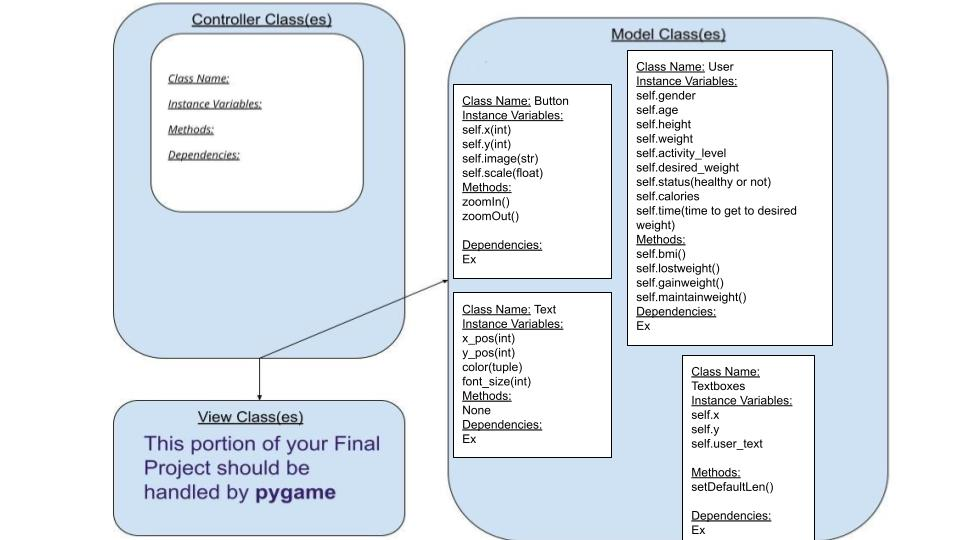

:warning: Everything between << >> needs to be replaced (remove << >> after replacing)
# CS110 Project Proposal
# Fitness Tracker
## CS 110 Final Project
### Fall, 2021
### [Assignment Description](https://docs.google.com/document/d/1H4R6yLL7som1lglyXWZ04RvTp_RvRFCCBn6sqv-82ps/edit#)

 [https://github.com/bucs110a0fall21/final-project-average-python-enjoyers.git](#) 

 [https://docs.google.com/presentation/d/1rnbXS_-Nn0t2mkMVO9ry_y94jpxexDB1ny-qKlo7mpM/edit?usp=sharing](#) 

### Team: Average Python Enjoyers
#### Salmaan, Lucas, Shijun

***

## Project Description *(Software Lead)*
Fitness Tracker App: Enter in your current height, weight, age, desired weight, gender, and activity level. Then the app
will tell you exactly how healthy you are right now(bmi), how many calories you need to eat and how long you will be 
eating along with the macronutrient percentages to reach that weight and body fat percentage. 

***    

## User Interface Design *(Front End Specialist)*
* << A wireframe or drawing of the user interface concept along with a short description of the interface. You should have one for each screen in your program. >>
    * For example, if your program has a start screen, game screen, and game over screen, you should include a wireframe / screenshot / drawing of each one and a short description of the components
    * Main Page GUI
      
* << You should also have a screenshot of each screen for your final GUI >>

***        

## Program Design *(Backend Specialist)*
* Non-Standard libraries
    * << You should have a list of any additional libraries or modules used (pygame, request) beyond non-standard python. >>
    * For each additional module you should include
        * url for the module documentation
        * a short description of the module
        * requests https://docs.python-requests.org/en/latest/ Requests allows you to send HTTP/1.1 requests extremely easily
        * sys https://docs.python.org/3/library/sys.html This module provides access to some variables used or maintained 
      by the interpreter and to functions that interact strongly with the interpreter.
* Class Interface Design
    * << A simple drawing that shows the class relationships in your code (see below for an example). >>
        * Classes for GUI (main page)
          
        
    * This does not need to be overly detailed, but should show how your code fits into the Model/View/Controller paradigm.
* Classes
    * Classes: Textboxes, Buttons, Texts, Userdata

## Project Structure *(Software Lead)*

The Project is broken down into the following file structure:
* main.py
* bin
    * <all of your python files should go here>
* assets
    * <all of your media, i.e. images, font files, etc, should go here)
* etc
    * <This is a catch all folder for things that are not part of your project, but you want to keep with your project. Your demo video should go here.>

***

## Tasks and Responsibilities *(Software Lead)*
* You must outline the team member roles and who was responsible for each class/method, both individual and collaborative.

### Software Lead - Salmaan Ejaz

<< Worked as integration specialist by... >>

### Front End Specialist - Lucas Carroll

<< Front-end lead conducted significant research on... >>

### Back End Specialist - Shijun You

<< The back end specialist... >>

## Testing *(Software Lead)*
* << Describe your testing strategy for your project. >>
    * << Example >>

* Your ATP

| Step                  | Procedure     | Expected Results  | Actual Results |
| ----------------------|:-------------:| -----------------:| -------------- |
|  1  | Open the Terminal, navigate to the project folder, and type in “python3 main.py”  | A window should pop up, it should display a start and exit box as well as a title |           |
|  2  | Navigate cursor to the start button and left click on it.  | The screen should change to a new screen with empty textboxes with labels above each of them. |                 |
|  3  | Navigate cursor to the back button and left click on it  | The screen window should return to the previous screen  |          |
|  4  | Repeat step 2, then navigate cursor to the textbox under “Gender,” left click on it, and use the keyboard to enter your gender.   | The text box should hold the value  |          |
|  5  | Repeat step 4, this time navigating the cursor to the textbox labelled “Age” and entering your Age using the keyboard.   | The text box should hold the value  |          |
|  6  | Repeat step 4, this time navigating the cursor to the textbox labelled “Activity Level” and entering your activity level using the keyboard.  | The text box should hold the value  |          |
|  7  | Repeat step 4, this time navigating the cursor to the textbox labelled “Height” and entering your height using the keyboard.   | The text box should hold the value  |          |
|  8  | Repeat step 4, this time navigating the cursor to the textbox labelled “Weight” and entering your weight using the keyboard.   | The text box should hold the value  |          |
|  9  | Repeat step 4, this time navigating the cursor to the textbox labelled “Desired Weight” and entering your desired weight using the keyboard.  | The text box should hold the value  |          |
|  10  | Repeat step 4, this time navigating the cursor to the textbox labelled “Intensity” and entering your intensity using the keyboard. | The text box should hold the value  |          | 
  |  11  | Click the “Next” button  | The screen should change to a new screen that displays the user’s current BMI scale score, and the projected BMI scale score based on the user’s desired weight, whether or not the current and projected BMI of the desired weight is in a healthy range(If the BMI’s are healthy it should tell the user how many calories they would need to eat to reach their desired weight, as well as the macronutrients ratio they should be eating in).|          |
|  12  | Navigate cursor to the x button on the top right, and left click  | The program should stop functioning.   |          |
|  13  | Repeat step 1 and then navigate cursor to the exit button and | The program should open a window, and then stop functioning.|          |
etc...
