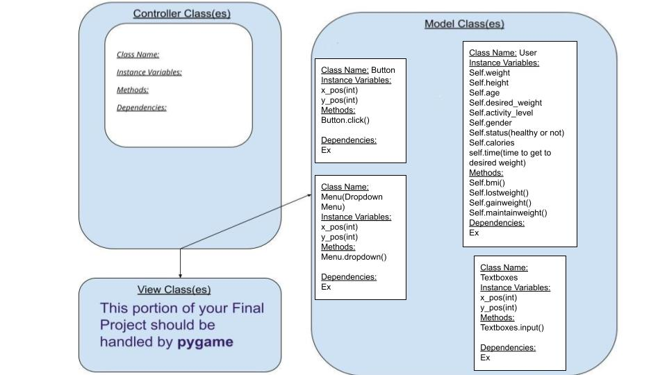

:warning: Everything between << >> needs to be replaced (remove << >> after replacing)
# CS110 Project Proposal
# Fitness Tracker
## CS 110 Final Project
### Fall, 2021
### [Assignment Description](https://docs.google.com/document/d/1H4R6yLL7som1lglyXWZ04RvTp_RvRFCCBn6sqv-82ps/edit#)

<< [https://github.com/<repo>](#) >>

<< [link to demo presentation slides](#) >>

### Team: Average Python Enjoyers
#### Salmaan, Lucas, Shijun

***

## Project Description *(Software Lead)*
Fitness Tracker App: Enter in your current height, weight, age, desired weight, gender, and activity level. Then the app
will tell you exactly how healthy you are right now(bmi), how many calories you need to eat and how long you will be 
eating along with the macronutrient percentages to reach that weight and body fat percentage. 

***    

## User Interface Design *(Front End Specialist)*
* << A wireframe or drawing of the user interface concept along with a short description of the interface. You should have one for each screen in your program. >>
    * For example, if your program has a start screen, game screen, and game over screen, you should include a wireframe / screenshot / drawing of each one and a short description of the components
    * Main Page GUI
      
    * Result Page GUI
      
* << You should also have a screenshot of each screen for your final GUI >>

***        

## Program Design *(Backend Specialist)*
* Non-Standard libraries
    * << You should have a list of any additional libraries or modules used (pygame, request) beyond non-standard python. >>
    * For each additional module you should include
        * url for the module documentation
        * a short description of the module
* Class Interface Design
    * << A simple drawing that shows the class relationships in your code (see below for an example). >>
        * Classes for GUI (main page)
          
        
    * This does not need to be overly detailed, but should show how your code fits into the Model/View/Controller paradigm.
* Classes
    * Classes for GUI 1 Main page: Age, gender, weight, desired_weight, height, activity level. (text boxes that takes inputs)
    * user(class that saves user preference and current data)

    * Classes for GUI 2 Result Page: Recommendation_Button.

## Project Structure *(Software Lead)*

The Project is broken down into the following file structure:
* main.py
* bin
    * <all of your python files should go here>
* assets
    * <all of your media, i.e. images, font files, etc, should go here)
* etc
    * <This is a catch all folder for things that are not part of your project, but you want to keep with your project. Your demo video should go here.>

***

## Tasks and Responsibilities *(Software Lead)*
* You must outline the team member roles and who was responsible for each class/method, both individual and collaborative.

### Software Lead - Salmaan Ejaz

<< Worked as integration specialist by... >>

### Front End Specialist - Lucas Carroll

<< Front-end lead conducted significant research on... >>

### Back End Specialist - Shijun You

<< The back end specialist... >>

## Testing *(Software Lead)*
* << Describe your testing strategy for your project. >>
    * << Example >>

* Your ATP

| Step                  | Procedure     | Expected Results  | Actual Results |
| ----------------------|:-------------:| -----------------:| -------------- |
|  1  | Run Counter Program  | GUI window appears with count = 0  |          |
|  2  | click count button  | display changes to count = 1 |                 |
etc...
