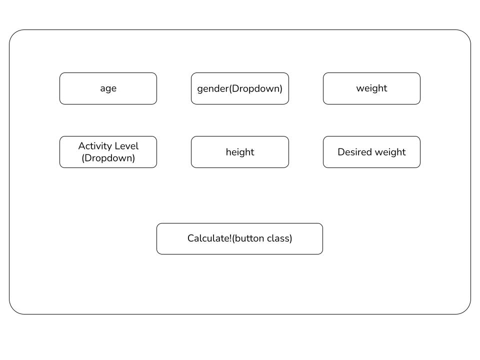
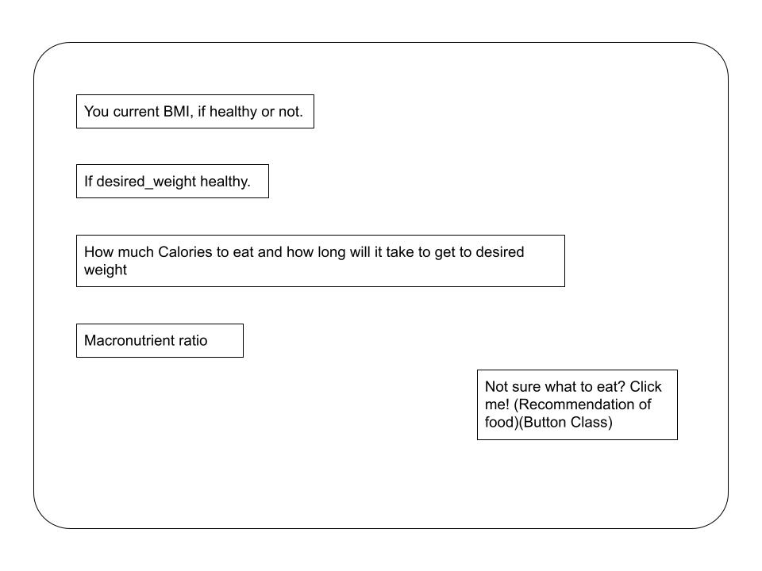
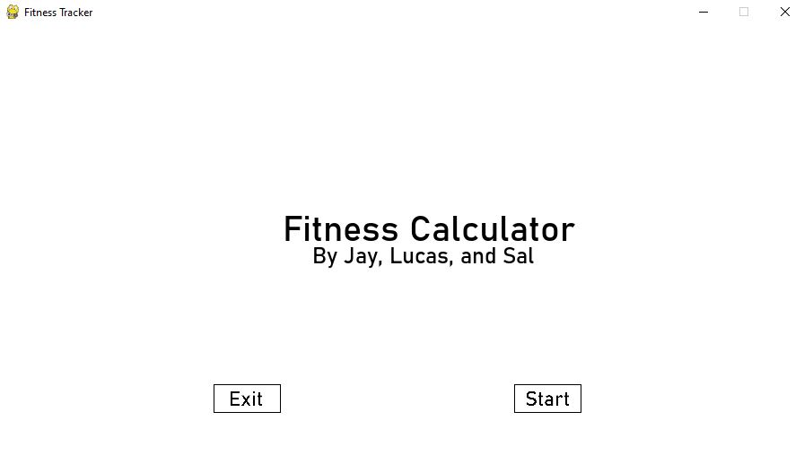
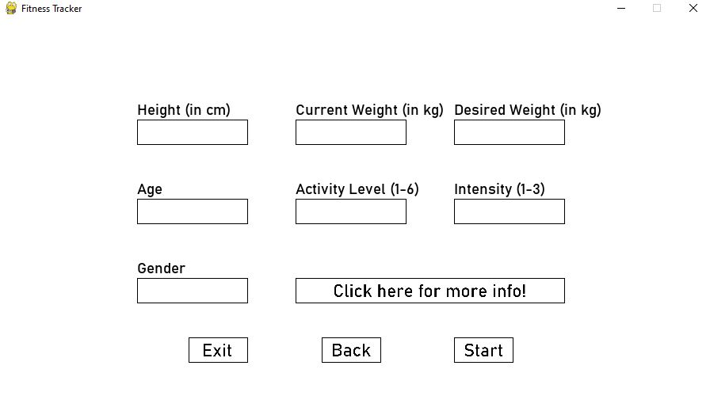
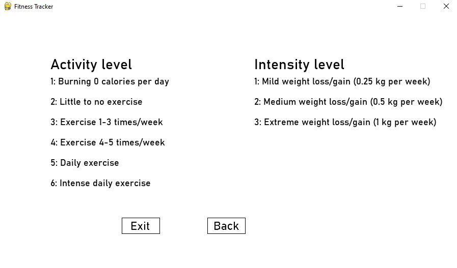
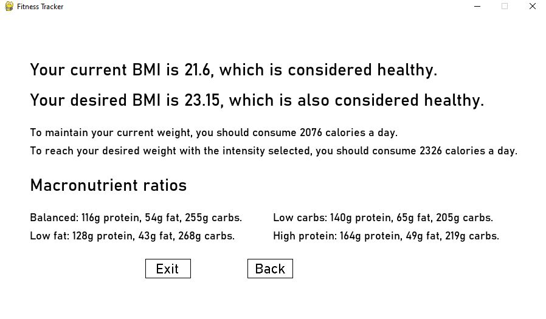
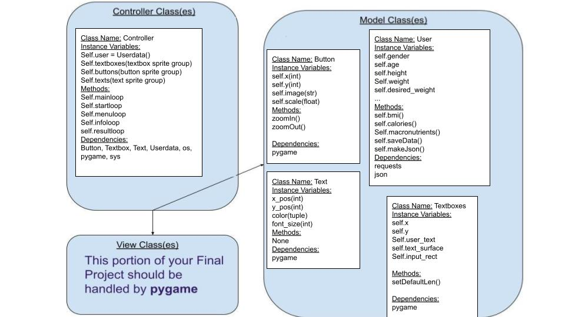

# CS110 Project Proposal
# Fitness Tracker
## CS 110 Final Project
### Fall, 2021
### [Assignment Description](https://docs.google.com/document/d/1H4R6yLL7som1lglyXWZ04RvTp_RvRFCCBn6sqv-82ps/edit#)

 Github link: https://github.com/bucs110a0fall21/final-project-average-python-enjoyers.git

 Presentation link: https://docs.google.com/presentation/d/1rnbXS_-Nn0t2mkMVO9ry_y94jpxexDB1ny-qKlo7mpM/edit?usp=sharing 

### Team: Average Python Enjoyers
#### Salmaan, Lucas, Shijun

***

## Project Description *(Software Lead)*
Fitness Tracker App: Enter in your current height, weight, age, desired weight, gender, and activity level. Then the app
will tell you exactly how healthy you are right now(bmi), how many calories you need to eat and how long you will be 
eating along with the macronutrient percentages to reach that weight and body fat percentage. 

***    

## User Interface Design *(Front End Specialist)*
* << A wireframe or drawing of the user interface concept along with a short description of the interface. You should have one for each screen in your program. >>
    * For example, if your program has a start screen, game screen, and game over screen, you should include a wireframe / screenshot / drawing of each one and a short description of the components
    * Main Page GUI
      
    * End Page GUI
      
* << You should also have a screenshot of each screen for your final GUI >>
    * Main Page GUI
      
    * User Data Page GUI
      
    * More Info Page
      
    * End Page GUI
      
***        

## Program Design *(Backend Specialist)*
* Non-Standard libraries
  * pygame https://www.pygame.org/docs/ A program that is often used to make games. But we used it to display our application.
  * requests https://docs.python-requests.org/en/latest/ Requests allows you to send HTTP/1.1 requests extremely easily
* Class Interface Design
  * Classes for GUI (main page)
    
        
  * This does not need to be overly detailed, but should show how your code fits into the Model/View/Controller paradigm.
* Classes: 
  * Textbox: Sets up Textboxes on the screen, save user input and render them on the screen.
  * Button: Sets up Buttons on the screen. It has methods to zoom in and zoom out when mouse interact with it. Once certain button is clicked, the state of the Controller class changes.
  * Text: Sets up Texts on the screen. Gives user instructions of what to input for each textbox, displays information and fitness results.
  * Userdata: saves user information, pass them to api and return fitness information caculated by api. 

## Project Structure *(Software Lead)*

The Project is broken down into the following file structure:
* main.py
* bin
    * <all of your python files should go here>
* assets
    * <all of your media, i.e. images, font files, etc, should go here)
* etc
    * <This is a catch all folder for things that are not part of your project, but you want to keep with your project. Your demo video should go here.>

***

## Tasks and Responsibilities *(Software Lead)*
* You must outline the team member roles and who was responsible for each class/method, both individual and collaborative.

### Software Lead - Salmaan Ejaz

Made sure deadlines were met, organized weekly team meetings, resolved potential conflicts, monitored progress, cleaned code.

### Front End Specialist - Lucas Carroll

Worked on implementing GUI that utilizes our API to make the program functional, integrated API

### Back End Specialist - Shijun You

Worked on controller and model classes and integrating API, cleaned up code 

## Testing *(Software Lead)*
* I started the program, then I made sure the quit button functions by left clicking on it with my mouse, then I restarted the program and made sure the start button functions by left clicking on it with my mouse. I then moved my cursor to each textbox and left clicked on them and entered in my data. Then I moved my cursor to the back button and left clicked on it and then moved my cursor to the start button to ensure that my data stayed in the text boxes.Then I navigated my cursor to the more info button and left clicked on it to make sure it displayed the right screen, then I clicked on the back button and moved my cursor to the start button and left clicked on it. Then I ensured the data was correct and moved my cursor to the back button and left clicked on it, then I entered in strings into any text box that had an integers and I entered in integers into any text box that had a string, then I made sure the program didn't crash when I clicked the start button, then I closed the program. 

* Your ATP

| Step                  | Procedure     | Expected Results  | Actual Results |
| ----------------------|:-------------:| -----------------:| -------------- |
|  1  | Open the Terminal, navigate to the project folder, and type in “python3 main.py”  | A window should pop up, it should display a start and exit box as well as a title |           |
|  2  | Navigate cursor to the start button and left click on it.  | The screen should change to a new screen with empty textboxes with labels above each of them. |                 |
|  3  | Navigate cursor to the textbox under “Gender,” left click on it, and use the keyboard to enter your gender.   | The text box should hold the value  |          |
|  4  | Repeat step 3, this time navigating the cursor to the textbox labelled “Age” and entering your Age using the keyboard.   | The text box should hold the value  |          |
|  5  | Repeat step 3, this time navigating the cursor to the textbox labelled “Activity Level” and entering your activity level using the keyboard.  | The text box should hold the value  |          |
|  6  | Repeat step 3, this time navigating the cursor to the textbox labelled “Height” and entering your height using the keyboard.   | The text box should hold the value  |          |
|  7  | Repeat step 3, this time navigating the cursor to the textbox labelled “Weight” and entering your weight using the keyboard.   | The text box should hold the value  |          |
|  8  | Repeat step 3, this time navigating the cursor to the textbox labelled “Desired Weight” and entering your desired weight using the keyboard.  | The text box should hold the value  |          |
|  9  | Navigate the cursor to the text box titled "Click here for more info!" and left click on it.  | The screen should change to a screen that displays information about the values the user should enter for "Activity level" and "Intensity"  |          |
|  10  | Navigate cursor to the back button and left click on it.  | The screen should change to the previous screen that had the textboxes on it |          |
|  11  | Repeat step 3, this time navigating the cursor to the textbox labelled “Intensity” and entering your intensity using the keyboard. | The text box should hold the value  |          | 
|  12  | Navigate cursor to the “Start” button and left click on it | The screen should change to a new screen that displays the user’s current BMI scale score, and the projected BMI scale score based on the user’s desired weight, whether or not the current and projected BMI of the desired weight is in a healthy range(If the BMI’s are healthy it should tell the user how many calories they would need to eat to reach their desired weight, as well as the macronutrients ratio they should be eating in).|          |
|  13  | Navigate cursor to the back button and left click on it  | The screen should change to the previous screen with the user info.   |          |
|  14  | Repeat step 13  | The screen should change to the title screen.   |          |
|  15  |Navigate cursor to the exit button and left click on it. | The window should dissapear and the program should stop functioning.|          |
